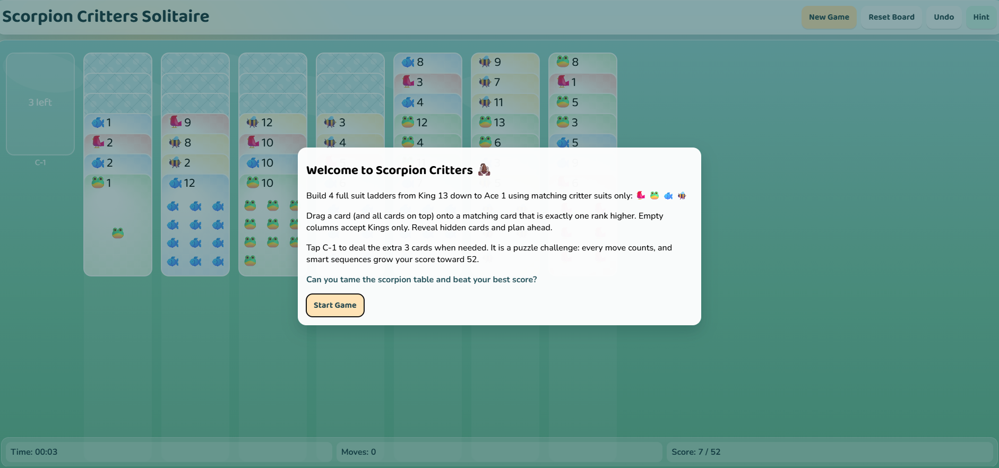
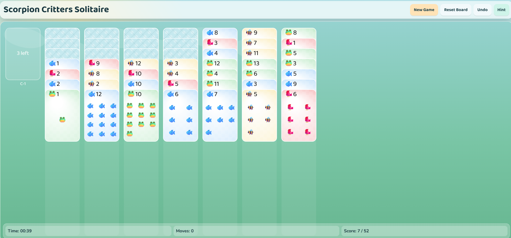

# Scorpion Critters Solitaire

A playful, kid-friendly variation of Scorpion Solitaire built with vanilla HTML, CSS, and JavaScript.

Live demo: https://pdemia.com/scs/

## About The Game

Scorpion Critters Solitaire keeps classic Scorpion core rules and replaces standard suits with fun critter suits:

- Red Ladybug: R 🐞
- Green Frog: G 🐸
- Blue Fish: B 🐟
- Yellow Bee: Y 🐝

The objective is to build 4 complete same-suit sequences from King (13) down to Ace (1).

## Highlights

- Canvas-based game board for clear and smooth gameplay on desktop and mobile.
- Portrait-friendly full-screen layout that keeps the whole play field visible.
- Cute visual style with matte card textures, soft colors, and emoji suit design.
- Drag-and-drop stack movement with move validation based on Scorpion rules.
- Hidden card reveal behavior when uncovered.
- Extra deck (C-1) with click/tap deal behavior.
- Unlimited undo support.
- Reset board to replay the same generated deck.
- Hint dialog for listing legal moves.
- Enhanced action-based scoring (not capped at 52).
- Win and game-over dialogs.
- Local high-score saving with player name (via localStorage).
- Welcome modal explaining rules in a fun and engaging style.

## Screenshots

### Welcome Screen

### Gameplay Deck View

## Controls

- New Game: Start a fresh shuffled deck.
- Reset Board: Restart the current deck from its original state.
- Undo: Revert one action (counts as a move in gameplay tracking).
- Hint: Show currently possible legal moves.
- Drag cards: Move a selected face-up stack to a valid target column.
- Click C-1 area: Deal extra deck cards to the first three columns.

## Scoring

- Deck score is action-based and rewards meaningful progress.
- Points are granted for uncovering hidden cards.
- Points are granted for creating empty columns (valuable King spaces).
- Points are granted for completing full suit runs (King to Ace).
- Small points are granted for legal moves and stock deals.
- Undo applies a score penalty to prevent easy score inflation.
- Win keeps your running score for the next deck.
- On game over, you can save your high score locally.

## Mobile Handling

- Responsive canvas sizing with portrait-first tuning.
- Dynamic card scaling based on viewport width so all 8 lanes (stock + 7 columns) stay visible.
- Dynamic vertical stack compression so very long columns still fit in the visible game field.
- Pointer Events are used for both mouse and touch input.
- Pointer capture is used during drag to keep stack movement stable on mobile.
- Safe-area aware spacing is applied for notched devices using viewport-fit and CSS env insets.

## Tech Stack

- HTML5
- CSS3
- JavaScript (class-based architecture, JSDoc typings)
- Canvas 2D API
- LocalStorage for high-score persistence

## Project Structure

- index.html
- index.css
- index.js
- screenshots/welcome.png
- screenshots/game.png

## Run Locally

Because this is a static project, you can run it directly from any local/static server.

Example:

1. Open the project folder in your local web server root.
2. Open index.html in browser, or visit your local hosted URL.

## Notes

This project evolves in multiple refinement phases focused on:

- Better UI/UX for kids and adults.
- Improved readability and interaction feedback.
- Cleaner gameplay flow with dialogs for onboarding and end states.
